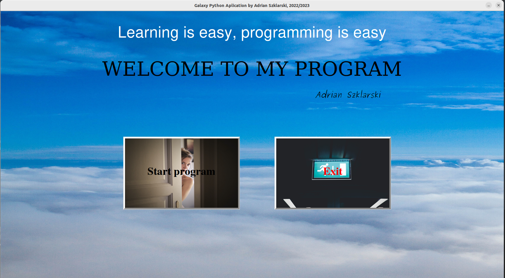

<h1 align="center">Galaxy Python Aplication</h1>

 

 GPA - is my application for learning Python programming. In addition, in the application are solved unusual engineering tasks and classical problems primarily all at a minimum academic level. The application also contains technical issues of Data Science, Machine Learninig and Neural Networks. Ala relaxation I also wrote some simple games in my edition. 

The application will include the following subsections as planned:

<ul>
<li>Aircraft</li>
<li>Arduino&Python</li>
<li>Engineering</li>
<li>Games</li>
<li>Missile</li>
<li>Programming</li>
<li>RecruitingTasks</li>
<li>Technology&Python</li>
</ul>

 

The application is "young", I started working on it so I am slowly building and updating it. On an ongoing basis, information about newly added functionality will appear in README.md.

 

I am currently building the framework of the application in Tkinter.

# License

This project is under the MIT license.

 
<h2 align="center">Created by Adrian Szklarski, start time 10.2022</h2>
